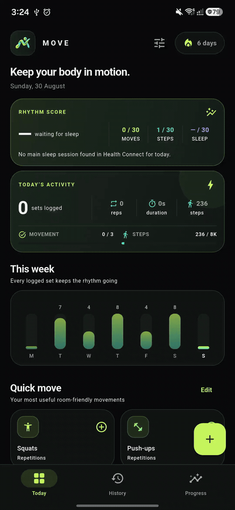

<div align="center">
  
  <h1>Move</h1>
  <p>A private, offline companion for daily movement, walking, and consistency.</p>
</div>

<p align="center">
  
</p>

## About

Move makes it fast to record small bursts of activity without accounts or subscriptions. Log repetitions such as squats and push-ups, track timed movements such as planks and stretches, and bring in daily steps and actual sleep sessions through read-only Health Connect access. Samsung Health supplies the daily step target plus the bedtime and wake-up target used for scoring. Activity history and preferences stay on the device.

## Features

- Quick repetition and duration logging
- 24 room-friendly strength and mobility movements
- Left, right, and both-side tracking where useful
- Optional notes plus log editing and deletion
- Read-only daily steps through Android Health Connect, including Samsung Health
- Read-only daily step target from Samsung Health, with a configurable Move fallback
- Read-only actual sleep sessions through Health Connect
- Read-only bedtime and wake-up target from Samsung Health, with fixed ±30-minute scoring windows
- Independent daily movement goal and Samsung Health step target
- Explainable 100-point Rhythm Score across moves, steps, sleep-target timing, and balance
- One optional, progress-aware reminder at a random time from 5 AM to 11 PM
- Customizable Quick Moves with add, remove, and drag ordering
- Weekly recaps, unified active-day streaks, and a 35-day consistency view
- Compact Home-screen widget for today’s goals and progress
- Per-movement rankings and progress summaries
- Offline SQLite persistence
- Purpose-built dark Material 3 interface
- Adaptive Android launcher icon

Accounts and cloud synchronization are intentionally outside the current scope.

## Download

Download the latest Android APK from [GitHub Releases](https://github.com/zavrenn/Move/releases/latest). Move supports Android 10 (API 29) and newer. Automatic steps and actual sleep sessions require Health Connect; Samsung Health supplies step and sleep targets when connected.

## Run locally

Requirements: Flutter 3.44+ with an Android 10 (API 29) or newer device or emulator.

```sh
flutter pub get
flutter run
```

Generate launcher resources again after replacing the source icon:

```sh
dart run flutter_launcher_icons
```

## Quality checks

```sh
flutter analyze
flutter test
cd android
./gradlew :app:testDebugUnitTest
```

## Project structure

```text
lib/
├── models.dart                 Movement catalog and log model
├── move_database.dart          SQLite persistence
├── analytics.dart              Streaks and progress calculations
├── dashboard_screen.dart       Today dashboard
├── history_screen.dart         Filterable activity history
├── progress_screen.dart        Trends and consistency views
├── movement_log_sheet.dart     Movement logging flow
├── quick_moves_sheet.dart      Quick Move customization
├── move_settings_sheet.dart    Goals, reminders, Health, and widget settings
└── device_services.dart        Health, reminders, goals, and widget bridge

android/app/src/main/kotlin/com/med/move/
├── MainActivity.kt             Health Connect, Samsung Health, and Flutter bridge
├── ReminderScheduler.kt        Daily reminder scheduling and delivery
├── MoveStateStore.kt           Shared goal, widget, and reminder state
└── MoveWidgetProvider.kt       Native home-screen widget
```

## Data and privacy

Move does not collect personal data. Movement logs are stored only in the app's local SQLite database. Removing the app also removes its local data unless Android restores it from a device backup.

When enabled, Move reads daily step totals and the timing of the main sleep session from Health Connect. Samsung Health supplies the daily step target plus the bedtime and wake-up target, from which Move derives fixed ±30-minute sleep windows. If the Samsung step target is unavailable, Move uses its locally configured fallback. Daily timing summaries are cached locally for dashboard and progress metrics; sleep duration is neither cached as a metric nor scored. Move never writes health data. Goals, reminders, Quick Moves, and widget state remain entirely on-device.

## License

Released under the [MIT License](LICENSE).
