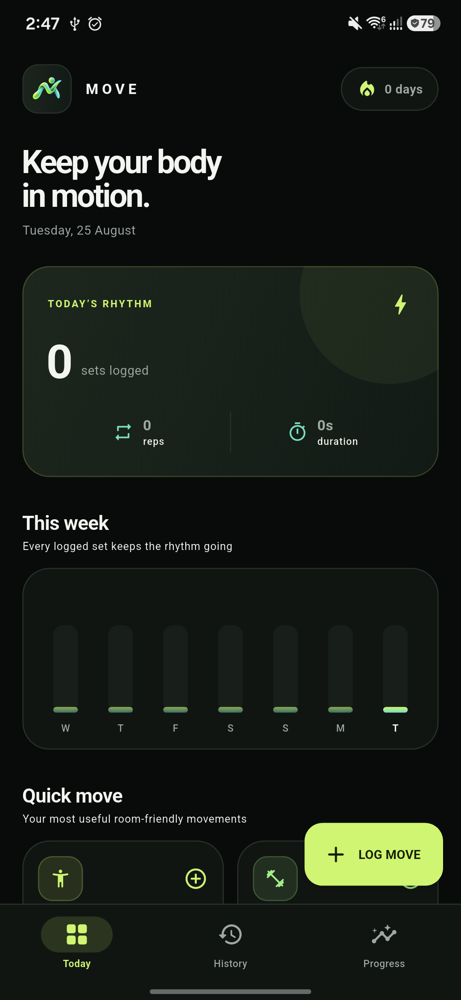

<div align="center">
  
  <h1>Move</h1>
  <p>A focused, private movement logger for people who spend a lot of time sitting.</p>
</div>

<p align="center">
  
</p>

## About

Move makes it fast to record small bursts of activity without accounts, subscriptions, or setup. Log repetitions such as squats, push-ups, and hand-grip squeezes, or timed movements such as planks and stretches. All data stays in a local SQLite database on the device.

## Features

- Quick repetition and duration logging
- 24 room-friendly strength and mobility movements
- Left, right, and both-side tracking where useful
- Optional notes plus log editing and deletion
- Read-only daily steps through Android Health Connect
- One optional, randomly timed daily movement reminder
- Daily streaks, weekly activity, and a 35-day consistency view
- Per-movement rankings and progress summaries
- Offline SQLite persistence
- Purpose-built dark Material 3 interface
- Adaptive Android launcher icon

Accounts and cloud synchronization are intentionally outside the current scope.

## Run locally

Requirements: Flutter 3.44+ with an Android device or emulator.

```sh
flutter pub get
flutter run
```

Generate launcher resources again after replacing the source icon:

```sh
dart run flutter_launcher_icons
```

## Quality checks

```sh
flutter analyze
flutter test
```

## Project structure

```text
lib/
├── models.dart                 Movement catalog and log model
├── move_database.dart          SQLite persistence
├── analytics.dart              Streaks and progress calculations
├── dashboard_screen.dart       Today dashboard
├── history_screen.dart         Filterable activity history
├── progress_screen.dart        Trends and consistency views
└── movement_log_sheet.dart     Movement logging flow
```

## Data and privacy

Move does not request network access or collect personal data. Movement logs are stored only in the app's local SQLite database. Removing the app also removes its local data unless Android restores it from a device backup.

When enabled, Move reads only daily step totals from Health Connect and caches them locally for dashboard and progress metrics. It never writes health data. Daily reminders are scheduled entirely on-device.

## License

Released under the [MIT License](LICENSE).
